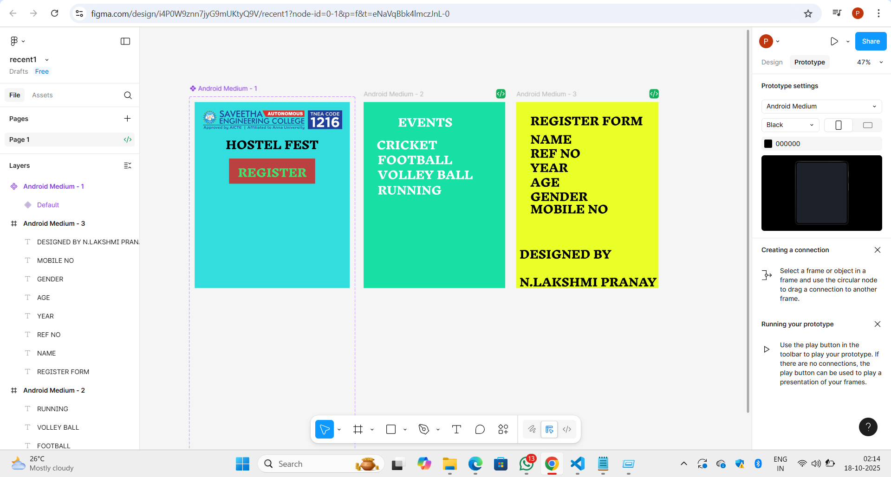

# Ex09 Event Registration Web Application
## Date:

## AIM:
To design, develop and deploy a web application for event registration.

## DESIGN STEPS:

### Step 1:
Create a new frame.

### Step 2:
Select any one preset size of your choice.

### Step 3:
Select the shapes you need.

### Step 4:
Import images as needed.

### Step 5:
Create pages based on your need and link them.

### Step 6:

Validate the HTML and CSS code.

### Step 6:

Publish the website in the given URL.

## DESIGN TOOL:
Figma

## CODE:
```
Page 1:
html 
<!DOCTYPE html>
<html>
  <head>
    <meta name="viewport" content="width=device-width, initial-scale=1" />
    <meta charset="utf-8" />
    <link rel="stylesheet" href="globals.css" />
    <link rel="stylesheet" href="style.css" />
  </head>
  <body>
    <div class="property-default">
      
      
      
      
      <div class="rectangle"></div>
      <div class="text-wrapper">REGISTER</div>
      <div class="div">HOSTEL FEST</div>
    </div>
  </body>
</html>


css
.property-default {
  position: relative;
  width: 573px;
  height: 688px;
  background-color: #33dcdc;
  overflow: hidden;
}

.property-default .text-on-a-path {
  position: absolute;
  top: 183px;
  left: 322px;
  width: 146px;
  height: 22px;
  object-fit: cover;
}

.property-default .logo {
  position: absolute;
  top: 26px;
  left: 24px;
  width: 528px;
  height: 80px;
  aspect-ratio: 6.65;
  object-fit: cover;
}

.property-default .img {
  left: 380px;
  width: 195px;
  height: 62px;
  position: absolute;
  top: 323px;
}

.property-default .text-on-a-path-2 {
  left: 353px;
  width: 258px;
  height: 74px;
  position: absolute;
  top: 323px;
}

.property-default .rectangle {
  position: absolute;
  top: 209px;
  left: 127px;
  width: 318px;
  height: 93px;
  background-color: #bb4040;
}

.property-default .text-wrapper {
  position: absolute;
  top: 209px;
  left: 160px;
  width: 254px;
  font-family: "Inknut Antiqua-ExtraBold", Helvetica;
  font-weight: 800;
  color: #3be46e;
  font-size: 40px;
  letter-spacing: 0;
  line-height: normal;
  white-space: nowrap;
}

.property-default .div {
  position: absolute;
  top: 106px;
  left: 115px;
  width: 350px;
  font-family: "Inknut Antiqua-ExtraBold", Helvetica;
  font-weight: 800;
  color: #000000;
  font-size: 40px;
  letter-spacing: 0;
  line-height: normal;
}


page 2:

html:-
<!DOCTYPE html>
<html>
  <head>
    <meta name="viewport" content="width=device-width, initial-scale=1" />
    <meta charset="utf-8" />
    <link rel="stylesheet" href="globals.css" />
    <link rel="stylesheet" href="style.css" />
  </head>
  <body>
    <div class="android-medium">
      <div class="text-wrapper">EVENTS</div>
      <div class="div">CRICKET</div>
      <div class="text-wrapper-2">FOOTBALL</div>
      <div class="text-wrapper-3">VOLLEY BALL</div>
      <div class="text-wrapper-4">RUNNING</div>
    </div>
  </body>
</html>


css:-
.android-medium {
  background-color: #17dea3;
  width: 100%;
  min-width: 523px;
  min-height: 688px;
  position: relative;
}

.android-medium .text-wrapper {
  position: absolute;
  top: 23px;
  left: 127px;
  width: 234px;
  font-family: "Inknut Antiqua-ExtraBold", Helvetica;
  font-weight: 800;
  color: #ffffff;
  font-size: 40px;
  letter-spacing: 0;
  line-height: normal;
}

.android-medium .div {
  position: absolute;
  top: 107px;
  left: 48px;
  width: 283px;
  font-family: "Inknut Antiqua-ExtraBold", Helvetica;
  font-weight: 800;
  color: #ffffff;
  font-size: 40px;
  letter-spacing: 0;
  line-height: normal;
}

.android-medium .text-wrapper-2 {
  position: absolute;
  top: 162px;
  left: 52px;
  width: 279px;
  font-family: "Inknut Antiqua-ExtraBold", Helvetica;
  font-weight: 800;
  color: #ffffff;
  font-size: 40px;
  letter-spacing: 0;
  line-height: normal;
}

.android-medium .text-wrapper-3 {
  position: absolute;
  top: 217px;
  left: 52px;
  width: 363px;
  font-family: "Inknut Antiqua-ExtraBold", Helvetica;
  font-weight: 800;
  color: #ffffff;
  font-size: 40px;
  letter-spacing: 0;
  line-height: normal;
}

.android-medium .text-wrapper-4 {
  position: absolute;
  top: 274px;
  left: 52px;
  width: 260px;
  font-family: "Inknut Antiqua-ExtraBold", Helvetica;
  font-weight: 800;
  color: #ffffff;
  font-size: 40px;
  letter-spacing: 0;
  line-height: normal;
}


page 3: 

html:- 
<!DOCTYPE html>
<html>
  <head>
    <meta name="viewport" content="width=device-width, initial-scale=1" />
    <meta charset="utf-8" />
    <link rel="stylesheet" href="globals.css" />
    <link rel="stylesheet" href="style.css" />
  </head>
  <body>
    <div class="android-medium">
      <div class="text-wrapper">REGISTER FORM</div>
      <div class="div">NAME</div>
      <div class="text-wrapper-2">REF NO</div>
      <div class="text-wrapper-3">YEAR</div>
      <div class="text-wrapper-4">AGE</div>
      <div class="text-wrapper-5">GENDER</div>
      <div class="text-wrapper-6">MOBILE NO</div>
      <div class="text-wrapper-7">DESIGNED BY N.LAKSHMI PRANAY</div>
    </div>
  </body>
</html>


css:-
.android-medium {
  background-color: #e9ff28;
  width: 100%;
  min-width: 526px;
  min-height: 688px;
  position: relative;
}

.android-medium .text-wrapper {
  position: absolute;
  top: 18px;
  left: 53px;
  width: 436px;
  font-family: "Inknut Antiqua-ExtraBold", Helvetica;
  font-weight: 800;
  color: #000000;
  font-size: 40px;
  letter-spacing: 0;
  line-height: normal;
}

.android-medium .div {
  position: absolute;
  top: 86px;
  left: 53px;
  width: 170px;
  font-family: "Inknut Antiqua-ExtraBold", Helvetica;
  font-weight: 800;
  color: #000000;
  font-size: 40px;
  letter-spacing: 0;
  line-height: normal;
}

.android-medium .text-wrapper-2 {
  position: absolute;
  top: 138px;
  left: 53px;
  width: 257px;
  font-family: "Inknut Antiqua-ExtraBold", Helvetica;
  font-weight: 800;
  color: #000000;
  font-size: 40px;
  letter-spacing: 0;
  line-height: normal;
}

.android-medium .text-wrapper-3 {
  position: absolute;
  top: 191px;
  left: 53px;
  width: 196px;
  font-family: "Inknut Antiqua-ExtraBold", Helvetica;
  font-weight: 800;
  color: #000000;
  font-size: 40px;
  letter-spacing: 0;
  line-height: normal;
}

.android-medium .text-wrapper-4 {
  position: absolute;
  top: 245px;
  left: 53px;
  width: 154px;
  font-family: "Inknut Antiqua-ExtraBold", Helvetica;
  font-weight: 800;
  color: #000000;
  font-size: 40px;
  letter-spacing: 0;
  line-height: normal;
}

.android-medium .text-wrapper-5 {
  position: absolute;
  top: 298px;
  left: 53px;
  width: 357px;
  font-family: "Inknut Antiqua-ExtraBold", Helvetica;
  font-weight: 800;
  color: #000000;
  font-size: 40px;
  letter-spacing: 0;
  line-height: normal;
}

.android-medium .text-wrapper-6 {
  position: absolute;
  top: 344px;
  left: 53px;
  width: 295px;
  font-family: "Inknut Antiqua-ExtraBold", Helvetica;
  font-weight: 800;
  color: #000000;
  font-size: 40px;
  letter-spacing: 0;
  line-height: normal;
}

.android-medium .text-wrapper-7 {
  position: absolute;
  top: 511px;
  left: 13px;
  width: 513px;
  font-family: "Inknut Antiqua-ExtraBold", Helvetica;
  font-weight: 800;
  color: #000000;
  font-size: 40px;
  letter-spacing: 0;
  line-height: normal;
}


```

## OUTPUT:


## RESULT:
The program to design, develop and deploy a web application for event registration is completed successfully.
